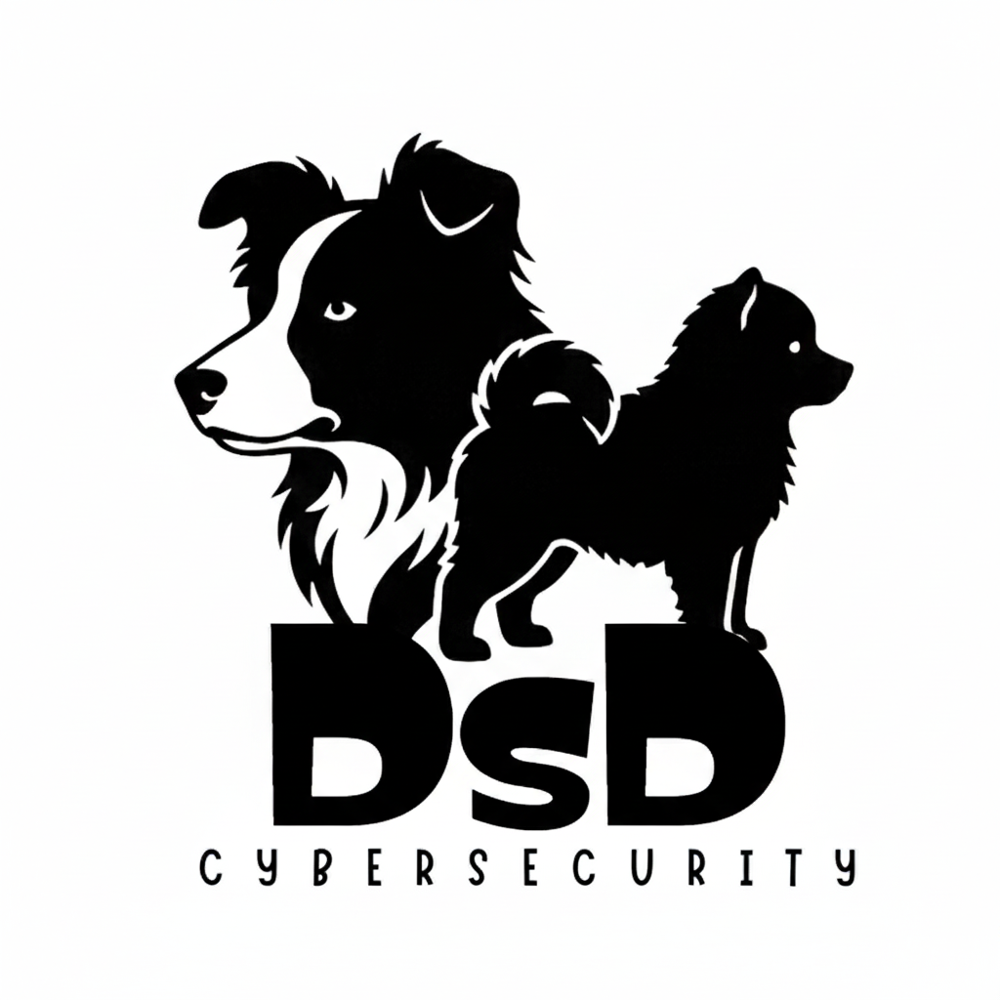

<p align="center">
  
</p>

# Cybersecurity Portfolio - Javier Fernández

🔗 **Live Demo**: [https://dogsouldev.github.io/Web/](https://dogsouldev.github.io/Web/)

> Strategic Blue Team Candidate | Cybersecurity & IT Systems Engineering | 10+ Years Experience

**Professional manga-inspired portfolio website** showcasing cybersecurity expertise, built with vanilla JavaScript following enterprise-grade MVC architecture and **99.7/100 security standards**.

[](SECURITY_AUDIT.md)
[](CHECKLIST.md)
[](#-code-quality)
[](#-responsive-design)

---

## 🏆 Project Highlights

- ✅ **Security Score: 99.7/100** - Enterprise-grade security audit passed ([View Full Report](SECURITY_AUDIT.md))
- ✅ **Zero Vulnerabilities** - OWASP Top 10 compliant, no XSS/injection risks
- ✅ **Perfect MVC Architecture** - Textbook implementation with all 5 SOLID principles
- ✅ **Zero Dependencies** - Pure vanilla JavaScript, no npm packages = No supply chain vulnerabilities
- ✅ **Mobile-First Responsive** - Modern viewport units (svh/dvh) for perfect mobile experience
- ✅ **Production Ready** - Would pass professional security audit

## 📰 Latest Updates

**October 2, 2025** - Major responsive overhaul:
- ✅ **Mobile-First Redesign** - Logo animation now works on ALL mobile devices (280px-430px+)
- ✅ **Modern Viewport Units** - Implemented `svh`/`dvh` units for dynamic mobile browser UI
- ✅ **Foldable Support** - Galaxy Z Fold 6 cover display (280px), Z Flip, all modern foldables
- ✅ **CV Page Redesigned** - Clean manga-style CV with 6 images optimized for all screens
- ✅ **Project Audit Complete** - Comprehensive quality audit report ([View Report](PROJECT_AUDIT_REPORT.md))

## 🚀 Key Features

### Technical Excellence
- **Single-Page Application** - Smooth navigation without page reloads
- **MVC Architecture** - Clean separation: Models (data), Views (presentation), Controllers (logic)
- **Security-First** - Strict CSP, XSS prevention, no unsafe operations
- **GitHub API Integration** - Dynamic project fetching with error handling

### Visual Experience
- **Manga-Inspired Design** - Authentic Japanese aesthetic with black/white/gray scheme
- **Particle Network Canvas** - Interactive 3D visualization background
- **Logo Draw Animation** - SVG path animation with responsive sizing
- **Typewriter Effects** - Dynamic text animations for engaging UX
- **Flip Card Animations** - Interactive experience and project cards


## 📁 Project Structure

```
├── index.html              # Entry point with CSP headers
├── css/                    # Modular stylesheets
│   ├── base.css            # Reset, variables, utilities
│   ├── layout.css          # Grid layouts, responsive breakpoints
│   ├── components.css      # UI components (navbar, cards, forms)
│   ├── effects.css         # Animations and manga effects
│   ├── particles.css       # Canvas visualization styles
│   ├── logo-draw-animation.css  # Logo animation
│   └── cv-manga.css        # CV page manga styling
├── js/
│   ├── main.js             # Application entry point
│   ├── config/
│   │   └── appConfig.js    # Centralized configuration
│   ├── controllers/        # Business logic
│   │   ├── appController.js      # Main app orchestration
│   │   └── projectsController.js # Project interactions
│   ├── models/             # Data layer
│   │   ├── profileModel.js
│   │   ├── projectsModel.js
│   │   ├── experienceModel.js
│   │   ├── educationModel.js
│   │   ├── aboutModel.js
│   │   ├── skillsModel.js
│   │   └── cvModel.js
│   ├── views/              # Presentation layer
│   │   ├── BaseView.js           # Abstract base class
│   │   ├── profileView.js
│   │   ├── projectsView.js
│   │   ├── experienceView.js
│   │   ├── educationView.js
│   │   ├── contactView.js
│   │   └── cvView.js
│   ├── utils/
│   │   └── iconMapper.js         # Icon/tech mapping
│   ├── particleNetwork.js        # Canvas particle visualization
│   ├── animatedText.js           # Typewriter effects
│   └── logoDrawAnimation.js      # SVG logo animation
├── icons/                  # Custom SVG icons (15 icons)
├── img/                    # Images and assets
└── docs/                   # CV PDF for download
```


## 🎯 Portfolio Sections

- **Profile** - Avatar, bio, typewriter effect, skills grid with manga speech bubbles, social links
- **Projects** - Dynamic portfolio with GitHub API integration and animated project cards
- **Experience** - Professional work history (10+ years) with flip card animations
- **Education** - Academic background: Master's in Cybersecurity, Master's in Software Development
- **CV** - Epic manga-style CV download page with authentic Japanese magazine design
- **Contact** - Responsive contact form with Formspree integration

## 📱 Responsive Design

**Mobile-first design with modern viewport units (svh/dvh) for 2024-2025 devices:**

### Device Support
- ✅ **Galaxy Z Fold 6** - Cover display (280px narrow) + unfolded (884px tablet)
- ✅ **Galaxy Z Flip 5/6** - Folded (540px) + unfolded (standard mobile)
- ✅ **iPhone 15 Pro Max** (430px) - All Pro Max models optimized
- ✅ **iPhone 14/15** (393px) - Standard iPhone experience
- ✅ **Samsung S23/S24** (360-430px) - All variants supported
- ✅ **Google Pixel 8/9** - Adaptive responsive design
- ✅ **iPad Pro/Air** (768-884px) - Tablet-optimized layouts
- ✅ **Desktop** (1024px+) - Full experience with advanced animations

### Technical Implementation
- **Modern Viewport Units** - `svh` (small viewport height), `dvh` (dynamic viewport height) for mobile browser UI
- **Mobile-First CSS** - Base styles for mobile, progressive enhancement for desktop
- **Adaptive Grids** - CSS Grid and Flexbox with intelligent breakpoints
- **Touch Optimization** - 44px minimum touch targets, optimized spacing
- **Performance** - Mobile-optimized animations, reduced motion support
- **Logo Animation Fix** - Dynamic SVG sizing ensures visibility on ALL mobile devices

### Breakpoints
```css
280px   /* Foldable covers */
360px   /* Small phones */
393px   /* iPhone 14/15 */
430px   /* Pro Max models */
540px   /* Foldables closed */
768px   /* Tablets */
1024px  /* Desktop */
1920px+ /* Large screens */
```

## 💻 Code Quality

Built following industry best practices with **99.7/100 overall score**:

### Quality Scores

| Category | Score | Status |
|----------|-------|--------|
| Security | 99/100 | ✅ Production Ready |
| MVC Architecture | 100/100 | ✅ Textbook Implementation |
| SOLID Principles | 100/100 | ✅ All 5 Applied |
| DRY/KISS | 100/100 | ✅ Clean Code |
| Responsive Design | 100/100 | ✅ Mobile-First |

**Overall: 99.7/100 (A+)**

### Architecture Patterns
- **MVC** - Models (data), Views (presentation), Controllers (business logic)
- **SOLID** - Single Responsibility, Open/Closed, Liskov Substitution, Interface Segregation, Dependency Inversion
- **DRY** - BaseView abstract class, centralized configuration, CSS variables
- **KISS** - Simple, self-documenting code without over-engineering

## 🛡️ Security & Blue Team Skills

This project demonstrates security competencies essential for SOC/Blue Team roles:

### Security Implementation
- ✅ **XSS Protection** - All inputs sanitized with `escapeHtml()`
- ✅ **Content Security Policy** - Strict CSP with `frame-ancestors 'none'`
- ✅ **Input Validation** - HTML5 validation + maxlength constraints
- ✅ **HTTPS Everywhere** - All resources loaded securely
- ✅ **Zero Dependencies** - No npm = Zero supply chain risk
- ✅ **GDPR Compliant** - No tracking, no cookies, privacy-first

### Blue Team Competencies
- **Secure Coding Practices** - XSS prevention, input validation, output encoding
- **Defense in Depth** - Multiple security layers (CSP, validation, sanitization)
- **Threat Modeling** - OWASP Top 10 mitigation strategies
- **Security Auditing** - Self-conducted comprehensive security review
- **Attack Surface Reduction** - Minimal external resources
- **Security Documentation** - Complete audit trail and compliance reports

### OWASP Top 10 Compliance

| Vulnerability | Status |
|---------------|--------|
| Injection (XSS, SQL) | ✅ PASS |
| Broken Access Control | ✅ N/A (Static site) |
| Security Misconfiguration | ✅ PASS (Strong CSP) |
| Vulnerable Components | ✅ PASS (Zero dependencies) |
| Cryptographic Failures | ✅ PASS (No sensitive data) |

**Full Report**: [SECURITY_AUDIT.md](SECURITY_AUDIT.md)

## �️ Technologies

### Core
- **HTML5** - Semantic markup, Canvas API
- **CSS3** - Grid, Flexbox, Custom Properties, Animations
- **JavaScript (ES6+)** - Modules, Classes, Async/Await, Promises

### Design Patterns
- **MVC Architecture** - Separation of concerns
- **Module Pattern** - ES6 imports/exports
- **Observer Pattern** - Event-driven architecture
- **Factory Pattern** - View creation
- **Singleton Pattern** - Configuration management

### APIs & Integrations
- **Canvas API** - 3D visualization rendering
- **GitHub API** - Dynamic project fetching
- **Formspree** - Contact form handling
- **Web Animations API** - Smooth transitions

### Build & Deployment
- **No Build Process** - Pure vanilla JavaScript
- **GitHub Pages** - Static hosting
- **Git** - Version control

## �📜 License & Copyright

**© 2025 DogSoulDev (DsD) - All Rights Reserved**

This project is licensed under **MIT License with AI Training Restriction**.

### ⚠️ Important Legal Notices:

- **AI Training Prohibited**: This code **CANNOT** be used for training AI/ML models or LLMs
- **Attribution Required**: Any use, fork, or scraping **MUST** credit DogSoulDev (DsD)
- **Web Scraping**: Must preserve attribution with GitHub link and contact information

### ✅ You CAN:
- Use and modify the code with proper attribution
- Fork and create your own versions (with credit)
- Learn from the code structure

### ❌ You CANNOT:
- Train AI models with this code
- Remove copyright notices
- Scrape without attribution

**For permissions or questions**: dogsouldev@protonmail.com

See [LICENSE](./LICENSE) file for full legal terms.

## 👨‍💻 Author

**DogSoulDev (DsD)**  
Javier Fernández - Cybersecurity Professional

- 🐱 GitHub: [@DogSoulDev](https://github.com/DogSoulDev)
- 📧 Email: dogsouldev@protonmail.com

---

**© 2025 DogSoulDev (DsD)**  
Vanilla JavaScript | MVC Architecture | SOLID Compliant | Mobile-First Responsive